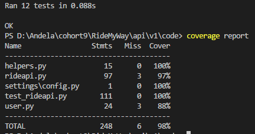
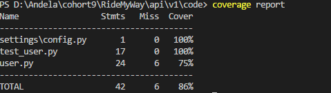

# RideMyWay

RideMyWay is a carpooling web application that provides drivers with the ability to create ride offers
and passengers to join available ride offers.
	
## features 
- Users can post ride offers
- Passangers can request to join a ride
- Drivers can view, accept and reject join requests
- Users can 

## [visit site](https://byarustev.github.io/RideMyWay/ui/)

## Travis Ci Badge

## Code Climate Maintainability Badge

## Code Climate Test Coverage Badge

## Coverage-badge for test_rideapi.py

## Coverage report for test_rideapi.py

## Coverage-badge for test_user.py

## Coverage report for test_user.py

## Index Page Interface

